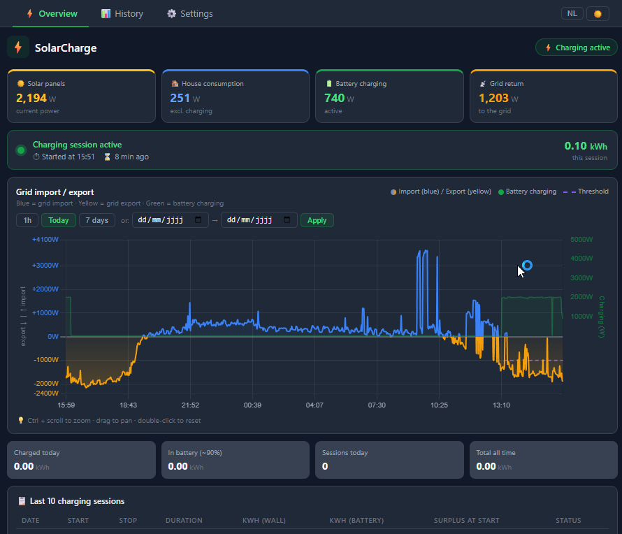
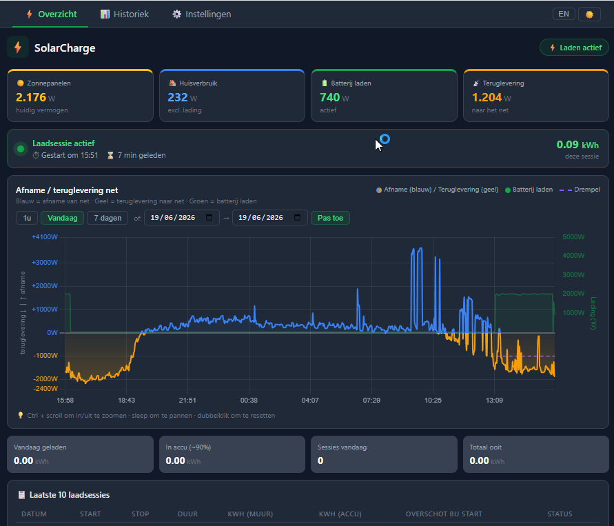

# SolarCharge

🇬🇧 [English](https://github.com/kgooris/solar_charger#english) &nbsp;|&nbsp; 🇧🇪 [Nederlands](https://github.com/kgooris/solar_charger#nederlands)

---

<a name="english"></a>

A Home Assistant custom integration that automatically charges your battery using excess solar energy — and gives you a live dashboard to monitor and track every charging session.

---

## The Problem It Solves

When you have solar panels, your inverter often produces more power than your home consumes. That surplus is normally sent back to the grid, often at a lower feed-in rate than what you pay for grid power. If you have a battery charger, this is wasted money.

This integration bridges that gap: it watches your net power meter in real time and turns on your battery charger the moment a configurable surplus is available — and turns it off again the moment that surplus disappears. No manual intervention needed.

```
Solar panels → produces 3 500 W
House consumption → uses 800 W
Surplus → 2 700 W going back to grid

Integration detects 2 700 W surplus → turns on battery charger
battery charger → draws 2 300 W from the surplus
Net to grid → only 400 W wasted
```

---

## What It Does

### Automatic surplus charging
- Monitors your P1 meter (net power import/export) in real time
- Turns your battery charger on when surplus exceeds a configurable threshold (default 500 W)
- Waits for a configurable delay (default 120 s) before switching on, to avoid reacting to brief clouds
- Turns the charger off after a configurable delay (default 180 s) when the surplus drops away
- Checks that the automation is enabled via a toggle in the dashboard before acting

### Live dashboard (sidebar panel)
A custom panel appears directly in the Home Assistant sidebar with three tabs:

**Overview tab**
- Four live power meters: solar panels, house consumption (excluding the charger), battery charging power, and grid return
- Active session banner with pulsing indicator, start time, elapsed duration, and live kWh counter
- Last session summary when no session is active
- Power graph (P1 net flow + battery charging) — switchable between last 1 hour, today, and 7 days
- Daily and total energy statistics

**History tab**
- Bar chart of charged energy per session (green = normal, orange = charger not connected)
- Filterable and paginated table of all sessions with date, start/stop time, duration, kWh at the wall, kWh in the battery (after efficiency loss), surplus at start, and status badge

**Settings tab**
- Toggle to enable/disable the automation without leaving the dashboard
- Adjustable thresholds: minimum surplus, switch-on delay, switch-off delay, charge efficiency, and "not plugged in" detection threshold
- Live sensor status overview showing entity IDs and current values

### Session tracking and storage
- Every completed charging session is saved to Home Assistant's own storage (survives restarts, included in HA backups)
- Stores start time, stop time, duration, kWh at the wall, estimated kWh in the battery, surplus at start, and session status
- Maximum 200 sessions kept automatically
- Sessions are classified as: completed (automatic), manual (automation was off), or not plugged in (charger on but low power draw)

### Persistent notifications
- "Charging started" notification with current surplus in watts
- "Charging stopped" notification with duration and kWh charged

### Daily midnight reset
- `solar_charger_energy_today` and `solar_charger_energy_in_battery_today` reset to 0 at midnight automatically

---

## Requirements

### Hardware
| Component | Example | Notes |
|-----------|---------|-------|
| P1 net meter | HomeWizard P1 | Provides active power in W, negative = export |
| Solar inverter | SolarEdge, SMA SunnyBoy | Any HA-integrated inverter with a power sensor |
| Smart switch on charger | Shelly, Sonoff, MQTT relay | Must be a `switch.*` entity in HA; optional built-in power meter |

### Software
- Home Assistant 2023.6 or newer
- HACS (for HACS installation)

---

## Installation

### Via HACS (recommended)

1. Open HACS in Home Assistant
2. Go to **Integrations → ⋮ → Custom repositories**
3. Add `https://github.com/kgooris/solar_charger` as category **Integration**
4. Search for **SolarCharge** and install
5. Restart Home Assistant

### Manual installation

Copy the `custom_components/solar_charger/` folder into your HA config directory:

```
config/
└── custom_components/
    └── solar_charger/
        ├── __init__.py
        ├── config_flow.py
        ├── const.py
        ├── manifest.json
        ├── storage.py
        ├── strings.json
        ├── translations/
        │   └── nl.json
        └── www/
            └── panel.html
```

Restart Home Assistant.

---

## Configuration

Go to **Settings → Integrations → + Add Integration → SolarCharge**.

The wizard runs in four steps:

**Step 1 — P1 meter**
Select the power sensor from your net meter. This sensor must report in watts, with **negative values meaning export to the grid** (surplus). Typical entity: `sensor.homewizard_p1_active_power_w`.

**Step 2 — Solar inverter**
Select the current output power sensor of your solar inverter (always positive during the day, 0 at night).

**Step 3 — battery charger**
- Select the switch that controls your charger (`switch.*`)
- Optionally select the built-in power meter of your smart switch — used for accurate kWh tracking
- Set the maximum charge power (kW) — used as fallback if no power meter is selected

**Step 4 — Thresholds**
| Setting | Default | Description |
|---------|---------|-------------|
| Minimum surplus | 500 W | Surplus must exceed this before charging starts |
| Switch-on delay | 120 s | Surplus must be stable for this long before turning on |
| Switch-off delay | 180 s | Deficit must last this long before turning off |
| Charge efficiency | 90 % | Energy loss between the wall socket and the battery |

All thresholds can be changed later without re-running the wizard: either via **Settings → Integrations → SolarCharge → Options**, or directly in the dashboard Settings tab.

---

## Entities

All entities are created automatically as native integration entities when the integration first loads. No manual setup needed.

| Entity ID | Type | Description |
|-----------|------|-------------|
| `switch.solar_charger_automation_enabled` | Switch | Master switch for the charging automation |
| `number.solar_charger_energy_today` | Number | Energy charged today (kWh) |
| `number.solar_charger_energy_in_battery_today` | Number | Estimated energy in the battery today (kWh) |
| `number.solar_charger_energy_total` | Number | Total energy charged all time (kWh) |
| `number.solar_charger_session_duration_minutes` | Number | Duration of the last session (min) |
| `number.solar_charger_min_surplus` | Number | Live-adjustable minimum surplus threshold (W) |
| `number.solar_charger_delay_on` | Number | Live-adjustable switch-on delay (s) |
| `number.solar_charger_delay_off` | Number | Live-adjustable switch-off delay (s) |
| `number.solar_charger_efficiency` | Number | Live-adjustable charge efficiency (%) |
| `number.solar_charger_noplug_threshold` | Number | "Not plugged in" detection threshold (W) |
| `text.solar_charger_session_start` | Text | ISO timestamp of the current session start |
| `text.solar_charger_session_stop` | Text | ISO timestamp of the last session stop |

---

## How the Automation Works

The integration does not create HA automations in `automations.yaml`. Instead, it runs the logic directly in Python using Home Assistant's event system:

1. It subscribes to state-change events on your P1 sensor.
2. On each P1 update, the charger's own power consumption is **subtracted** from the P1 reading. This gives the true solar surplus available to the house, excluding the charger itself — preventing the charger's own load from making it look like the surplus has disappeared.
3. When the adjusted P1 value drops to or below `-min_surplus` (export ≥ threshold) and the charger is off:
   - A timer is started for `delay_on` seconds.
   - If the surplus remains sufficient until the timer fires, the charger is turned on.
   - If the surplus disappears before the timer fires, the timer is cancelled.
4. When the adjusted P1 value rises above `-min_surplus` (surplus drops) and the charger is on:
   - A timer is started for `delay_off` seconds.
   - If the surplus has not returned when the timer fires, the charger is turned off.
   - If the surplus returns before the timer fires, the timer is cancelled.
5. At midnight, `energy_today` and `energy_in_battery_today` are reset to 0.
6. When the charger turns off, the integration calculates the session duration and energy and writes the totals to the helper entities.

All timers and subscriptions are properly cancelled when the integration is unloaded or reconfigured.

---

## Reconfiguration

To change sensors or thresholds at any time:

**Settings → Integrations → SolarCharge → Options**

The full wizard reopens with all current values pre-filled. After saving, the integration reloads automatically and all timers restart with the new settings.

---

## Troubleshooting

**The panel does not appear in the sidebar**
The integration copies `panel.html` automatically on setup. If it is missing, check that the integration's `www/panel.html` source file is intact and reload the integration. A browser refresh (F5) is enough — no full HA restart is needed for the panel to appear.

**The charger does not turn on automatically**
1. Check that `switch.solar_charger_automation_enabled` exists and is set to **on**.
2. Verify that your P1 sensor is reporting negative values when your solar panels are producing more than the house consumes.
3. Check the Home Assistant logs for `SolarCharge` messages to see if the surplus threshold is being detected.

**kWh tracking seems inaccurate**
If your smart switch has a built-in power meter, make sure you configured it in step 3 of the wizard. Without it, the integration estimates kWh from `max_charge_kw × session_duration`, which does not account for partial charging speed.

Fine-tune the **charge efficiency** setting. Compare the "kWh in battery" value from the dashboard with what your battery app reports after a session, and adjust accordingly (typically 88–93 %).

**Sessions show "not plugged in" (orange)**
The charger switch was on but the measured power was below the "not plugged in" threshold (default 50 W). This can happen when the battery is fully charged and stops drawing power, or when the switch is turned on before the charger is connected. Adjust the threshold in the dashboard Settings tab.

---

## License

MIT — see [LICENSE](LICENSE) for details.

---

<a name="nederlands"></a>

# SolarCharge — Nederlandstalige versie

Een Home Assistant custom integratie die je batterij automatisch oplaadt met zonne-energie-overschot — met een live dashboard om elke laadsessie te monitoren en bij te houden.

---

## Het probleem dat het oplost

Wanneer je zonnepanelen meer produceren dan je huis verbruikt, gaat het overschot terug naar het net — vaak aan een lagere vergoeding dan wat je betaalt voor stroom. Als je een batterijlader hebt, is dat weggegooid geld.

Deze integratie overbrugt die kloof: ze bewaakt je netteller in real time en schakelt je batterijlader in zodra er voldoende overschot beschikbaar is — en schakelt ze weer uit wanneer dat overschot wegvalt. Geen manuele tussenkomst nodig.

```
Zonnepanelen → produceren 3 500 W
Huisverbruik → verbruikt 800 W
Overschot → 2 700 W terug naar het net

Integratie detecteert 2 700 W overschot → schakelt batterijlader in
Batterijlader → neemt 2 300 W van het overschot
Netto naar net → slechts 400 W verspild
```

---

## Wat het doet

### Automatisch laden op overschot
- Bewaakt je P1-meter (netto import/export) in real time
- Schakelt de batterijlader in wanneer het overschot een instelbare drempel overschrijdt (standaard 500 W)
- Wacht een instelbare vertraging (standaard 120 s) voor het inschakelkommando, om niet te reageren op korte bewolking
- Schakelt de lader uit na een instelbare vertraging (standaard 180 s) wanneer het overschot wegvalt
- Controleert of de automatisering ingeschakeld is via een schakelaar in het dashboard

### Live dashboard (sidebar panel)
Een custom panel verschijnt direct in de Home Assistant zijbalk met drie tabbladen:

**Overzicht**
- Vier live vermogenmeters: zonnepanelen, huisverbruik (excl. lader), laadvermogen batterij, teruglevering
- Actieve sessiebanner met pulserend lampje, starttijd, verstreken duur en live kWh-teller
- Samenvatting laatste sessie als er geen sessie actief is
- Vermogensgrafiek (P1 netstroom + autoladen) — schakelbaar tussen laatste 1 uur, vandaag en 7 dagen
- Dagelijkse en totale energiestatistieken

**Historiek**
- Staafgrafiek van geladen energie per sessie (groen = normaal, oranje = lader niet ingesloten)
- Filterbare en gepagineerde tabel van alle sessies met datum, start-/stoptijd, duur, kWh aan de muur, kWh in de accu (na efficiëntieverlies), overschot bij start en statusbadge

**Instellingen**
- Schakelaar om de automatisering in/uit te schakelen zonder het dashboard te verlaten
- Aanpasbare drempelwaarden: minimaal overschot, inschakelvertraging, uitschakelvertraging, laadefficiëntie en drempel "niet ingeplugd"
- Live sensorstatusoverzicht met entity-ID's en actuele waarden

### Sessieopslag
- Elke voltooide laadsessie wordt opgeslagen in de eigen HA-opslag (overleeft herstarten, zit in HA-backups)
- Slaat op: starttijd, stoptijd, duur, kWh aan de muur, geschatte kWh in de accu, overschot bij start en status
- Maximum 200 sessies worden bijgehouden
- Sessies worden geclassificeerd als: voltooid (automatisch), handmatig (automatisering stond uit) of niet ingeplugd (schakelaar aan maar weinig vermogen)

### Meldingen
- "Batterij laden gestart" melding met huidig overschot in watt
- "Batterij laden gestopt" melding met duur en geladen kWh

### Dagelijkse reset om middernacht
- `solar_charger_energy_today` en `solar_charger_energy_in_battery_today` worden automatisch om middernacht op 0 gezet

---

## Vereisten

### Hardware
| Component | Voorbeeld | Opmerkingen |
|-----------|-----------|-------------|
| P1 netteller | HomeWizard P1 | Geeft actief vermogen in W, negatief = export |
| Zonne-omvormer | SolarEdge, SMA SunnyBoy | Elke HA-integratie met vermogensensor |
| Slimme schakelaar op lader | Shelly, Sonoff, MQTT-relais | Moet een `switch.*` entity zijn in HA; ingebouwde energiemeter optioneel |

### Software
- Home Assistant 2023.6 of nieuwer
- HACS (voor installatie via HACS)

---

## Installatie

### Via HACS (aanbevolen)

1. Open HACS in Home Assistant
2. Ga naar **Integraties → ⋮ → Aangepaste opslagplaatsen**
3. Voeg `https://github.com/kgooris/solar_charger` toe als categorie **Integratie**
4. Zoek op **SolarCharge** en installeer
5. Herstart Home Assistant

### Handmatige installatie

Kopieer de map `custom_components/solar_charger/` naar je HA-configuratiemap:

```
config/
└── custom_components/
    └── solar_charger/
        ├── __init__.py
        ├── config_flow.py
        ├── const.py
        ├── manifest.json
        ├── storage.py
        ├── strings.json
        ├── translations/
        │   └── nl.json
        └── www/
            └── panel.html
```

Herstart Home Assistant.

---

## Configuratie

Ga naar **Instellingen → Integraties → + Integratie toevoegen → SolarCharge**.

De wizard doorloopt vier stappen:

**Stap 1 — P1 meter**
Selecteer de vermogensensor van je netteller. Deze sensor moet rapporteren in watt, met **negatieve waarden bij export naar het net** (overschot). Typisch: `sensor.homewizard_p1_active_power_w`.

**Stap 2 — Zonne-omvormer**
Selecteer de actuele vermogensensor van je omvormer (altijd positief overdag, 0 's nachts).

**Stap 3 — Batterijlader**
- Selecteer de schakelaar die je batterijlader aanstuurt (`switch.*`)
- Optioneel: selecteer de ingebouwde energiemeter van je slimme schakelaar — voor nauwkeurige kWh-registratie
- Stel het maximale laadvermogen in (kW) — gebruikt als fallback zonder energiemeter

**Stap 4 — Drempelwaarden**
| Instelling | Standaard | Omschrijving |
|------------|-----------|--------------|
| Minimaal overschot | 500 W | Overschot moet deze drempel overschrijden voor laden start |
| Inschakelvertraging | 120 s | Overschot moet zo lang stabiel zijn voor inschakelen |
| Uitschakelvertraging | 180 s | Tekort moet zo lang aanhouden voor uitschakelen |
| Laadefficiëntie | 90 % | Energieverlies tussen stopcontact en de accu |

Alle drempelwaarden zijn later aanpasbaar zonder de wizard opnieuw te doorlopen: via **Instellingen → Integraties → SolarCharge → Opties**, of rechtstreeks in het tabblad Instellingen van het dashboard.

---

## Entities

Alle entities worden automatisch aangemaakt als native integratie-entities bij de eerste keer laden. Geen manuele stap vereist.

| Entity ID | Type | Omschrijving |
|-----------|------|--------------|
| `switch.solar_charger_automation_enabled` | Schakelaar | Hoofdschakelaar voor de laadautomatisering |
| `number.solar_charger_energy_today` | Getal | Geladen energie vandaag (kWh) |
| `number.solar_charger_energy_in_battery_today` | Getal | Geschatte energie in de accu vandaag (kWh) |
| `number.solar_charger_energy_total` | Getal | Totaal geladen energie ooit (kWh) |
| `number.solar_charger_session_duration_minutes` | Getal | Duur van de laatste sessie (min) |
| `number.solar_charger_min_surplus` | Getal | Live aanpasbare overschotdrempel (W) |
| `number.solar_charger_delay_on` | Getal | Live aanpasbare inschakelvertraging (s) |
| `number.solar_charger_delay_off` | Getal | Live aanpasbare uitschakelvertraging (s) |
| `number.solar_charger_efficiency` | Getal | Live aanpasbare laadefficiëntie (%) |
| `number.solar_charger_noplug_threshold` | Getal | Drempel voor detectie "niet ingeplugd" (W) |
| `text.solar_charger_session_start` | Tekst | ISO-tijdstip van huidige of laatste sessiestart |
| `text.solar_charger_session_stop` | Tekst | ISO-tijdstip van laatste sessiestop |

---

## Hoe de automatisering werkt

De integratie maakt geen automatiseringen aan in `automations.yaml`. De logica draait rechtstreeks in Python via het HA event-systeem:

1. Ze abonneert zich op toestandswijzigingen van je P1-sensor.
2. Bij elke P1-update wordt het eigen laadvermogen van de batterijlader **afgetrokken** van de P1-waarde. Dit geeft het echte zonne-overschot exclusief de lader zelf — waardoor de lader zijn eigen consumptie niet laat lijken alsof het overschot weggevallen is.
3. Wanneer de gecorrigeerde P1-waarde daalt naar of onder `-min_surplus` (export ≥ drempel) en de lader uitstaat:
   - Een timer van `delay_on` seconden wordt gestart.
   - Als het overschot blijft tot de timer afloopt, wordt de lader ingeschakeld.
   - Verdwijnt het overschot voor de timer afloopt, dan wordt de timer geannuleerd.
4. Wanneer de gecorrigeerde P1-waarde stijgt boven `-min_surplus` (overschot valt weg) en de lader aanstaat:
   - Een timer van `delay_off` seconden wordt gestart.
   - Als het overschot niet terugkeert voor de timer afloopt, wordt de lader uitgeschakeld.
   - Keert het overschot terug voor de timer afloopt, dan wordt de timer geannuleerd.
5. Om middernacht worden `energy_today` en `energy_in_battery_today` gereset naar 0.
6. Wanneer de lader uitschakelt, berekent de integratie de sessieduur en energie en schrijft de totalen naar de helper-entities.

Alle timers en abonnementen worden netjes geannuleerd wanneer de integratie wordt verwijderd of hergeladen.

---

## Herconfiguratie

Ga naar: **Instellingen → Integraties → SolarCharge → Opties**

De volledige wizard herstart met alle huidige waarden vooringevuld. Na opslaan herlaadt de integratie automatisch en starten alle timers opnieuw met de nieuwe instellingen.

---

## Problemen oplossen

**Het panel verschijnt niet in de zijbalk**
De integratie kopieert `panel.html` automatisch bij setup. Als het ontbreekt, controleer dan of het bronbestand `www/panel.html` in de integratiemap aanwezig is en herlaad de integratie. Een browserverversing (F5) volstaat — een volledige HA-herstart is niet nodig voor het panel.

**De lader schakelt niet automatisch in**
1. Controleer of `switch.solar_charger_automation_enabled` bestaat en **aan** staat.
2. Verifieer dat je P1-sensor negatieve waarden rapporteert wanneer je zonnepanelen meer produceren dan het huis verbruikt.
3. Bekijk de Home Assistant logs op berichten met `SolarCharge` om te zien of de overschotdrempel gedetecteerd wordt.

**kWh-registratie lijkt onnauwkeurig**
Als je slimme schakelaar een ingebouwde energiemeter heeft, controleer dan of je die in stap 3 van de wizard hebt geconfigureerd. Zonder energiemeter schat de integratie kWh op basis van `max_laadvermogen × sessieduur`, wat geen rekening houdt met variabel laadvermogen.

Stel de **laadefficiëntie** nauwkeuriger in. Vergelijk de "kWh in accu"-waarde uit het dashboard met wat je batterij-app rapporteert na een sessie, en pas de instelling aan (typisch 88–93 %).

**Sessies tonen "niet ingeplugd" (oranje)**
De laadschakelaar stond aan maar het gemeten vermogen lag onder de drempel voor "niet ingeplugd" (standaard 50 W). Dit kan gebeuren wanneer de batterij volledig opgeladen is en stopt met afnemen, of wanneer de schakelaar wordt ingeschakeld voor de lader is aangesloten. Pas de drempel aan in het tabblad Instellingen van het dashboard.

---

## Licentie

MIT — zie [LICENSE](LICENSE) voor details.
